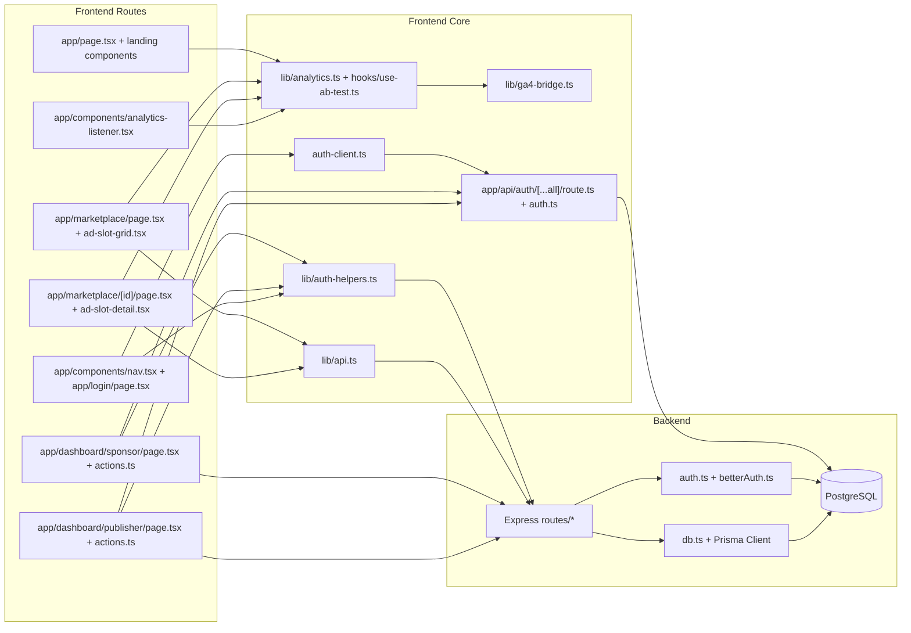
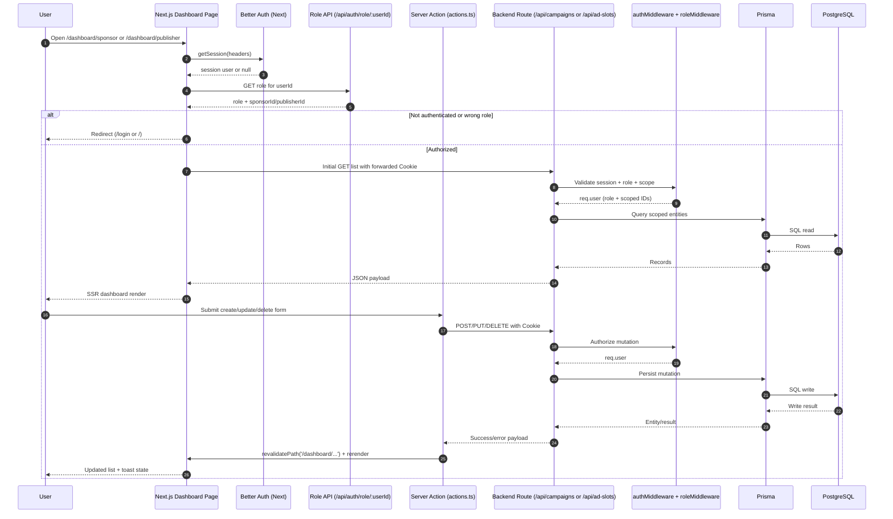
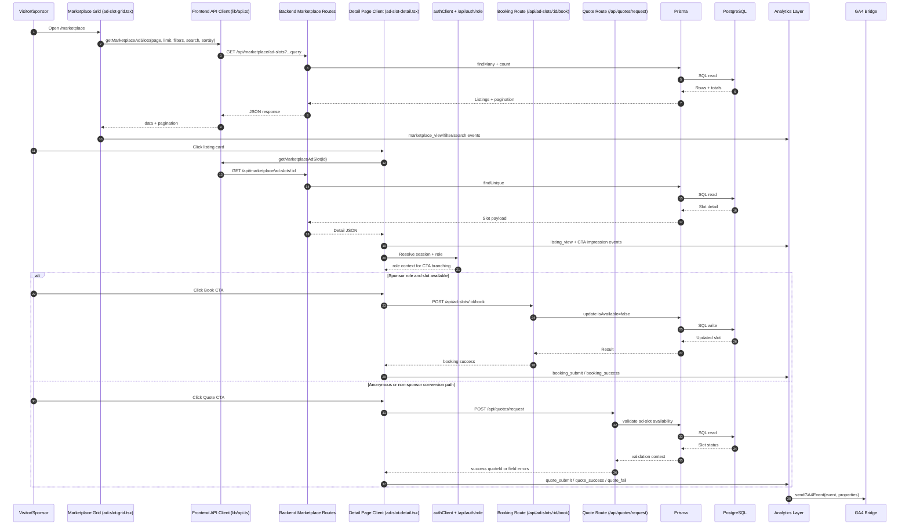

# Anvara Sponsorship Marketplace

This repository started as a take-home scaffold and now reflects an implemented full-stack marketplace with role-aware dashboards, conversion flows, and instrumentation. This README documents the current behavior and architecture.

## Current State Snapshot

As of **2026-02-20**:

- Monorepo: PNPM workspaces (`apps/frontend`, `apps/backend`, shared configs in `packages/*`)
- Frontend: Next.js 16 + React 19 + Tailwind CSS v4
- Backend: Express 5 + Prisma 7 + PostgreSQL 16
- Auth: Better Auth (Next.js route handlers + backend session validation bridge)
- Analytics: Client-side analytics abstraction with GA4 bridge and A/B test hooks
- Data layer: Prisma client via `@prisma/adapter-pg`, Postgres in Docker

Runtime defaults:

- Node.js `>=20.0.0` (required by repo `engines`)
- Frontend: `http://localhost:3847`
- Backend API: `http://localhost:4291`
- PostgreSQL: `localhost:5498`

## Quick Start

```bash
# 1) Install, configure env, start docker db, migrate, seed
pnpm setup-project

# 2) Run frontend + backend together
pnpm dev
```

Useful commands:

```bash
# Quality
pnpm lint
pnpm typecheck
pnpm test

# Formatting
pnpm format

# Database / reset helpers
pnpm --filter @anvara/backend db:studio
pnpm stop
pnpm reset
```

See `docs/setup.md` for manual setup details.

## Demo Accounts

| Role      | Email                 | Password   | Expected Dashboard         |
| --------- | --------------------- | ---------- | -------------------------- |
| Sponsor   | `sponsor@example.com` | `password` | `/dashboard/sponsor`       |
| Publisher | `publisher@example.com` | `password` | `/dashboard/publisher`   |

## Implemented Features

- **Marketing landing page** (`apps/frontend/app/page.tsx`, `apps/frontend/app/components/landing/*`)
  - Multi-section landing composition with SEO metadata in page-level `metadata`.
- **Marketplace browse with filters + pagination** (`apps/frontend/app/marketplace/page.tsx`, `apps/frontend/app/marketplace/components/ad-slot-grid.tsx`, `apps/frontend/app/marketplace/components/marketplace-filters.tsx`)
  - Type/category/search/availability/sort filters, server-backed pagination, loading/empty/error states.
- **Marketplace detail + conversion paths** (`apps/frontend/app/marketplace/[id]/components/ad-slot-detail.tsx`)
  - Detail rendering, role-based CTA branching, booking modal, quote modal, conversion analytics.
- **Role-protected sponsor dashboard CRUD** (`apps/frontend/app/dashboard/sponsor/page.tsx`, `apps/frontend/app/dashboard/sponsor/actions.ts`)
  - Server-side session + role gating, server action create/update/delete against backend campaign endpoints.
- **Role-protected publisher dashboard CRUD** (`apps/frontend/app/dashboard/publisher/page.tsx`, `apps/frontend/app/dashboard/publisher/actions.ts`)
  - Server-side session + role gating, server action create/update/delete against backend ad-slot endpoints.
- **Newsletter signup flow** (`apps/frontend/app/components/footer-actions.ts`, `apps/backend/src/routes/newsletter.ts`)
  - Server action submission with validation-aware error handling.
- **Quote request flow with attachments** (`apps/frontend/app/marketplace/[id]/components/quote-modal.tsx`, `apps/backend/src/routes/quotes.ts`)
  - Client-side attachment validation + backend field validation and quote reference response.
- **Analytics + experimentation** (`apps/frontend/lib/analytics.ts`, `apps/frontend/hooks/use-ab-test.ts`)
  - Event abstraction, dedupe window, attribution metadata, GA4 bridge, cookie-backed A/B assignment/exposure/outcome tracking.

## Architecture Overview

- **Frontend app router layer** (`apps/frontend/app/*`)
  - Public routes: landing + marketplace.
  - Protected routes: sponsor/publisher dashboards.
  - Shared UX primitives: nav, shell, error/empty/skeleton states.
- **Frontend integration layer** (`apps/frontend/lib/*`, `apps/frontend/hooks/*`)
  - `lib/api.ts`: HTTP wrapper + normalized error model (`ApiError`).
  - `lib/auth-helpers.ts`: centralized role lookup.
  - `lib/analytics.ts` + `lib/ga4-bridge.ts`: instrumentation pipeline.
  - `hooks/use-ab-test.ts`: variant assignment + exposure + outcomes.
- **Backend route layer** (`apps/backend/src/routes/*`)
  - Domain routes for marketplace, campaigns, ad-slots, auth, quotes, newsletter, etc.
  - Auth and role enforcement handled via `authMiddleware` + `roleMiddleware`.
- **Persistence layer** (`apps/backend/src/db.ts`, `apps/backend/prisma/schema.prisma`)
  - Prisma client with Postgres adapter.
  - Core entities: Sponsor, Publisher, Campaign, Creative, AdSlot, Placement, Payment.
- **Auth boundaries**
  - Next.js Better Auth handlers: `apps/frontend/app/api/auth/[...all]/route.ts`.
  - Backend session validation bridge: `apps/backend/src/betterAuth.ts` + `apps/backend/src/auth.ts`.

## Design Justifications

### 1) Role-protected dashboards use server-side gating + server actions

- Why this approach:
  - `apps/frontend/app/dashboard/*/page.tsx` blocks access during SSR using session and role checks.
  - `actions.ts` keeps mutation logic server-side and revalidates dashboard routes after writes.
- Tradeoff:
  - More network hops (frontend server action -> backend API) than a direct DB mutation path in Next.js.

### 2) Marketplace discovery is client-driven for filter + pagination responsiveness

- Why this approach:
  - `apps/frontend/app/marketplace/components/ad-slot-grid.tsx` maintains immediate filter/page interaction and retry/offline handling in one client state machine.
- Tradeoff:
  - First meaningful listings load happens client-side instead of SSR; this is noted in the page FIXME and can impact perceived initial load/SEO depth.

### 3) Role resolution is centralized via `/api/auth/role/:userId`

- Why this approach:
  - Shared contract used by `apps/frontend/lib/auth-helpers.ts`, nav/login, and detail CTA gating reduces duplicated role-mapping logic.
  - Backend source of truth lives in `apps/backend/src/routes/auth.ts`.
- Tradeoff:
  - Extra API call after session lookup in some paths.

### 4) Reusable state primitives standardize UX for edge states

- Why this approach:
  - `apps/frontend/app/components/EmptyState.tsx`, `apps/frontend/app/components/ErrorState.tsx`, and `apps/frontend/app/components/SkeletonCard.tsx` create consistent loading/error/empty behavior across marketplace and dashboards.
- Tradeoff:
  - Shared components can limit one-off page-specific visual customization unless extended.

### 5) Analytics abstraction + GA bridge isolates instrumentation concerns

- Why this approach:
  - `apps/frontend/lib/analytics.ts` normalizes event naming, deduplication, and attribution metadata while `apps/frontend/lib/ga4-bridge.ts` handles transport details.
- Tradeoff:
  - Custom abstraction requires discipline to keep event taxonomy consistent as features grow.

### 6) CSS variable token system enables theme consistency and dark/light behavior

- Why this approach:
  - `apps/frontend/app/globals.css` defines semantic tokens (`--color-*`) and explicit light/dark overrides consumed throughout UI components.
- Tradeoff:
  - Theme behavior depends on keeping token usage consistent; ad hoc hardcoded colors reduce system benefits.

## Information Flow Charts

### Module & File Interaction Map



### Authenticated Dashboard CRUD Sequence (Sponsor/Publisher)



### Marketplace Discovery to Conversion Sequence



## Backend API Surface

Auth expectation legend:

- `Public`: no auth middleware
- `Authenticated`: requires valid Better Auth session via backend middleware
- `Sponsor only`: authenticated + `SPONSOR` role
- `Publisher only`: authenticated + `PUBLISHER` role

### Auth

| Method | Path | Auth Expectation | Notes |
| ------ | ---- | ---------------- | ----- |
| POST | `/api/auth/login` | Public | Placeholder endpoint; frontend Better Auth flow is source of truth |
| GET | `/api/auth/me` | Authenticated | Returns current user attached by middleware |
| GET | `/api/auth/role/:userId` | Public | Resolves sponsor/publisher role mapping |

### Marketplace (Public Read)

| Method | Path | Auth Expectation | Notes |
| ------ | ---- | ---------------- | ----- |
| GET | `/api/marketplace/ad-slots` | Public | Filter/sort/paginate listings |
| GET | `/api/marketplace/ad-slots/:id` | Public | Listing detail |

### Campaigns (Sponsor)

| Method | Path | Auth Expectation | Notes |
| ------ | ---- | ---------------- | ----- |
| GET | `/api/campaigns` | Sponsor only | List current sponsor campaigns |
| GET | `/api/campaigns/:id` | Sponsor only | Sponsor-owned campaign detail |
| POST | `/api/campaigns` | Sponsor only | Create campaign |
| PUT | `/api/campaigns/:id` | Sponsor only | Update sponsor-owned campaign |
| DELETE | `/api/campaigns/:id` | Sponsor only | Delete sponsor-owned campaign |

### Ad Slots (Publisher + Sponsor Booking)

| Method | Path | Auth Expectation | Notes |
| ------ | ---- | ---------------- | ----- |
| GET | `/api/ad-slots` | Publisher only | List current publisher ad slots |
| GET | `/api/ad-slots/:id` | Publisher only | Publisher-owned ad slot detail |
| POST | `/api/ad-slots` | Publisher only | Create ad slot |
| PUT | `/api/ad-slots/:id` | Publisher only | Update publisher-owned ad slot |
| DELETE | `/api/ad-slots/:id` | Publisher only | Delete publisher-owned ad slot |
| POST | `/api/ad-slots/:id/book` | Sponsor only | Mark slot booked |
| POST | `/api/ad-slots/:id/unbook` | Sponsor only | Reset availability (testing utility path) |

### Quotes and Newsletter

| Method | Path | Auth Expectation | Notes |
| ------ | ---- | ---------------- | ----- |
| POST | `/api/quotes/request` | Public | Validated quote request with optional attachments |
| POST | `/api/newsletter/subscribe` | Public | Validated newsletter signup (in-memory store) |

### Sponsors / Publishers / Placements / Platform

| Method | Path | Auth Expectation | Notes |
| ------ | ---- | ---------------- | ----- |
| GET | `/api/sponsors` | Public | Sponsor list |
| GET | `/api/sponsors/:id` | Public | Sponsor detail |
| POST | `/api/sponsors` | Public | Create sponsor |
| PUT | `/api/sponsors/:id` | Sponsor only | Update current sponsor profile |
| GET | `/api/publishers` | Public | Publisher list |
| GET | `/api/publishers/:id` | Public | Publisher detail |
| GET | `/api/placements` | Public | Placement list |
| POST | `/api/placements` | Public | Create placement |
| GET | `/api/dashboard/stats` | Public | Aggregate platform stats |
| GET | `/api/health` | Public | Health + DB connectivity check |

## Quality & Testing Status

Status captured on **2026-02-20**:

- `pnpm lint`: passes
- `pnpm typecheck`: passes
- `pnpm test`: fails at workspace level because:
  - frontend has no test files (`vitest` exits with code 1)
  - backend test file exists but tests are currently skipped/todo
- Environment caveat:
  - repo expects Node `>=20`, and running with older Node versions emits engine warnings

## Known Gaps / Next Improvements

Updated on **2026-02-20**:

- ✅ Harden backend bootstrap in `apps/backend/src/index.ts`:
  - production CORS allowlist via `CORS_ALLOWED_ORIGINS`
  - global API rate limiting via `express-rate-limit`
- ✅ Added missing sponsor update endpoint in `apps/backend/src/routes/sponsors.ts`:
  - `PUT /api/sponsors/:id` (authenticated sponsor ownership required)
- ✅ Improved marketplace fetch strategy in `apps/frontend/app/marketplace/page.tsx`:
  - initial listings load is server-fetched with URL-driven query state hydration
- ✅ Moved nav role lookup off the client in `apps/frontend/app/components/nav.tsx`:
  - role resolved server-side and passed to client nav UI
- ✅ Added global layout-level error/loading wrappers:
  - `apps/frontend/app/global-error.tsx`
  - `apps/frontend/app/loading.tsx`
- Remaining gap:
  - Increase test coverage (add frontend tests and convert backend skipped/todo tests to active assertions)

## Repository Map

```text
apps/
  frontend/
    app/
      api/auth/[...all]/route.ts      # Better Auth Next handler
      dashboard/sponsor/*              # Sponsor SSR page + server actions + UI
      dashboard/publisher/*            # Publisher SSR page + server actions + UI
      marketplace/*                    # Public listing + detail + conversion flows
      components/*                     # Shared UI, state primitives, nav, analytics listener
    lib/
      api.ts                           # API client + error normalization
      analytics.ts                     # Event taxonomy + dedupe + attribution
      ga4-bridge.ts                    # GA4 transport
      auth-helpers.ts                  # Role lookup helper
    hooks/
      use-ab-test.ts                   # Cookie-backed A/B assignment/exposure
    auth.ts                            # Better Auth server config
    auth-client.ts                     # Better Auth client hooks/API
  backend/
    src/
      index.ts                         # Express app bootstrap
      auth.ts                          # Backend auth middleware + role middleware
      betterAuth.ts                    # Better Auth instance for backend session checks
      db.ts                            # Prisma client singleton
      routes/*                         # API domains
    prisma/
      schema.prisma                    # Domain schema
      seed.ts                          # Demo account/data seeding
packages/
  config/                              # Shared tsconfig
  eslint-config/                       # Shared lint rules
  prettier-config/                     # Shared format rules
scripts/
  setup.ts                             # End-to-end local setup
  reset.ts                             # Local cleanup/reset helper
docs/
  setup.md                             # Setup guide
  submission.md                        # Submission notes/process
```
