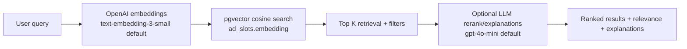
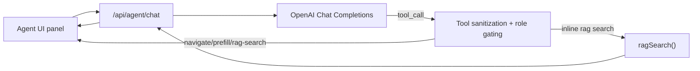

# Anvara

## 1. Executive Summary
Anvara is a full-stack sponsorship marketplace monorepo with:
- A public marketplace for discovering publisher ad slots.
- Role-gated dashboards for sponsors (campaign management) and publishers (ad inventory management).
- Better Auth email/password authentication with session cookies.
- An AI-assisted RAG search endpoint for marketplace matching.
- An in-app agent (`/api/agent/chat`) that can navigate, prefill forms, and run marketplace RAG search via controlled tool-calling.

The repo currently implements local development with Dockerized Postgres + pgvector, Express API, and Next.js App Router frontend.

## 2. Architecture Overview

### Frontend stack
- `Next.js 16` + `React 19` (`apps/frontend`)
- App Router (`apps/frontend/app/*`)
- Tailwind CSS v4
- Server Components for route-level data loading and auth/role gating.
- Client Components for interactive UI (filters, pagination state, modals, agent chat, analytics listeners).

### Backend stack
- `Express 5` API (`apps/backend/src`)
- Prisma 7 with `@prisma/adapter-pg`
- Middleware:
  - JSON body parsing (`20mb` limit)
  - CORS allowlist with production fail-closed behavior
  - Global API rate limiting in production (`/api`, excluding `/health`)
  - Route-level rate limits for RAG and agent endpoints
- Auth/role enforcement via Better Auth session lookup + role middleware

### Database
- PostgreSQL 16 + `pgvector` (local Docker image `pgvector/pgvector:pg16`)
- Prisma schema for:
  - `Sponsor`, `Publisher`, `Campaign`, `Creative`, `AdSlot`, `Placement`, `Payment`
- `AdSlot.embedding` is stored as `vector(1536)`.
- Better Auth tables are created/seeded by seed script (`user`, `session`, `account`, `verification`).

### RAG pipeline flow


### Agent architecture


### Auth and role model
- Better Auth is exposed in Next route handlers: `apps/frontend/app/api/auth/[...all]/route.ts`.
- Backend validates session cookies using Better Auth server instance.
- Role is derived from DB linkage:
  - sponsor if `sponsors.userId = session.user.id`
  - publisher if `publishers.userId = session.user.id`
- Role-gated routes use middleware (`SPONSOR` or `PUBLISHER`).

### Deployment model (implemented in repo)
- Local Docker Compose for Postgres + pgvector.
- `Dockerfile.dev` for development container tooling.
- No implemented ECS/ECR/SQS/Modal worker/CI-CD pipeline files in this repository.

## 3. Local Development Setup

### Prerequisites
- Node.js `>=20`
- `pnpm` (repo uses `pnpm@10.28.0`)
- Docker Desktop (or Docker Engine)

### Quick setup (automated)
```bash
pnpm install
pnpm setup-project
pnpm dev
```

### Manual setup (verified with current repo)
1. Install deps:
```bash
pnpm install
```
2. Create env file:
```bash
cp .env.example .env
```
3. Start database:
```bash
docker compose up -d
```
4. Run migrations + seed from backend package:
```bash
pnpm --filter @anvara/backend db:migrate
pnpm --filter @anvara/backend seed
```
5. Optional (required for RAG retrieval quality): generate embeddings for seeded ad slots:
```bash
pnpm --filter @anvara/backend embed-seed
```
6. Run backend and frontend:
```bash
pnpm --filter @anvara/backend dev
pnpm --filter @anvara/frontend dev
```

### Default local ports
- Frontend: `http://localhost:3847`
- Backend: `http://localhost:4291`
- Postgres: `localhost:5498`

## 4. Environment Variables

### Shared
| Variable | Required | Notes |
|---|---|---|
| `DATABASE_URL` | Yes | Required by Prisma, backend Better Auth, frontend Better Auth server, seed/embed scripts. |
| `BETTER_AUTH_SECRET` | Required in production | Dev fallback exists but should not be used in production. |
| `BETTER_AUTH_URL` | Required in production | Defaults to `http://localhost:3847` in dev. |
| `OPENAI_API_KEY` | Required when `RAG_ENABLED=true`, `AGENT_ENABLED=true`, or `embed-seed` is used | Used by embeddings, RAG rerank, and agent LLM calls. |

### Backend
| Variable | Required | Notes |
|---|---|---|
| `BACKEND_PORT` | No | Default `4291`. |
| `CORS_ALLOWED_ORIGINS` | Required in production | Comma-separated allowlist. In dev it falls back to localhost origins. |
| `RATE_LIMIT_WINDOW_MS` | No | Production global API limiter window. Default `900000`. |
| `RATE_LIMIT_MAX_REQUESTS` | No | Production global API limiter max. Default `120`. |
| `RAG_ENABLED` | No | Enables `/api/marketplace/rag-search` and rag status. |
| `RAG_EMBEDDING_MODEL` | No | Default `text-embedding-3-small`. |
| `RAG_LLM_MODEL` | No | Default `gpt-4o-mini`. |
| `RAG_TOP_K` | No | Default top-k for retrieval. |
| `RAG_SIMILARITY_THRESHOLD` | No | Float `0..1`, default `0.3`. |
| `RAG_LLM_TIMEOUT_MS` | No | LLM reranking timeout, default `10000`. |
| `RAG_RATE_LIMIT_PER_MINUTE` | No | Route limit for rag-search, default `10`. |
| `AGENT_ENABLED` | No | Enables `/api/agent/chat` and agent status. |
| `AGENT_RATE_LIMIT_PER_MINUTE` | No | Agent route limit, default `20`. |
| `AGENT_LLM_MODEL` | No | Overrides agent model (falls back to `RAG_LLM_MODEL`, then `gpt-4o-mini`). |
| `AGENT_LLM_TIMEOUT_MS` | No | Overrides agent timeout (falls back to `RAG_LLM_TIMEOUT_MS`, then `10000`). |
| `NODE_ENV` | Runtime | Controls trust proxy, production-only global rate limiting, and CORS fail-closed behavior. |

### Frontend
| Variable | Required | Notes |
|---|---|---|
| `NEXT_PUBLIC_API_URL` | No | Backend API base URL. Default `http://localhost:4291`. |
| `NEXT_PUBLIC_BETTER_AUTH_URL` | No | Better Auth client base URL. Default `http://localhost:3847`. |
| `NEXT_PUBLIC_GA_MEASUREMENT_ID` | No | GA4 enabled only when format matches `G-...`. |

## 5. API Overview
All backend routes are mounted under `/api`.

### Marketplace and RAG
- `GET /api/marketplace/ad-slots`
  - Public listing.
  - Supports `page`, `limit`, `type`, `available`, `category`, `search`, `sortBy`.
  - Returns `{ data, pagination }`.
- `GET /api/marketplace/ad-slots/:id`
- `GET /api/marketplace/rag-status`
- `POST /api/marketplace/rag-search`
  - Enabled only when `RAG_ENABLED=true` and `OPENAI_API_KEY` is set.
  - Body: `query`, optional `topK`, `filters`, `skipRanking`.

### Agent
- `GET /api/agent/status`
- `POST /api/agent/chat`
  - Enabled only when `AGENT_ENABLED=true`.
  - Optional auth; role inferred from session when present.
  - Tool calls are sanitized and role-checked server-side.

### Auth routes
- Better Auth (frontend route handlers): `GET/POST /api/auth/*` (Next app route)
- Backend auth utility routes:
  - `POST /api/auth/login` (placeholder; returns guidance to use frontend login)
  - `GET /api/auth/me` (authenticated session echo)
  - `GET /api/auth/role/:userId` (role resolution)

### Sponsor and publisher routes
- Sponsors:
  - `GET /api/sponsors`
  - `GET /api/sponsors/:id`
  - `POST /api/sponsors`
  - `PUT /api/sponsors/:id` (sponsor role + self-scope)
- Publishers:
  - `GET /api/publishers`
  - `GET /api/publishers/:id`
  - `PUT /api/publishers/:id` (publisher role + self-scope)

### Dashboard, campaigns, ad slots, placements
- Dashboard:
  - `GET /api/dashboard` (role-scoped, authenticated)
  - `GET /api/dashboard/stats` (public aggregate stats)
- Campaigns (sponsor-only + scoped):
  - `GET /api/campaigns` (paginated)
  - `GET /api/campaigns/:id`
  - `POST /api/campaigns`
  - `PUT /api/campaigns/:id`
  - `DELETE /api/campaigns/:id`
- Ad slots (publisher-only + scoped):
  - `GET /api/ad-slots` (paginated)
  - `GET /api/ad-slots/:id`
  - `POST /api/ad-slots`
  - `PUT /api/ad-slots/:id`
  - `DELETE /api/ad-slots/:id`
  - `POST /api/ad-slots/:id/book` (sponsor-only)
  - `POST /api/ad-slots/:id/unbook` (sponsor-only)
- Placements:
  - `GET /api/placements`
  - `POST /api/placements`

### Conversion/support routes
- `POST /api/newsletter/subscribe`
- `POST /api/quotes/request`
- `GET /api/health`

### Pagination pattern
Paginated endpoints return:
```json
{
  "data": [],
  "pagination": {
    "page": 1,
    "limit": 12,
    "total": 0,
    "totalPages": 0
  }
}
```

Implemented paginated endpoints:
- `/api/marketplace/ad-slots`
- `/api/campaigns`
- `/api/ad-slots`

## 6. RAG System

### Embeddings
- Model: `text-embedding-3-small` by default (`RAG_EMBEDDING_MODEL` override).
- Stored per ad slot in:
  - `ad_slots.embedding_text`
  - `ad_slots.embedding` (`vector(1536)`)
- Embedding refresh occurs when:
  - ad slots are created/updated
  - publisher profile updates (all publisher slots refreshed asynchronously)
  - `embed-seed` script is run

### Retrieval
- Vector similarity: cosine distance (`embedding <=> query_vector`) via pgvector.
- Filters applied in SQL: type/category/availability.
- Threshold gate: `RAG_SIMILARITY_THRESHOLD`.
- Retrieval size: top-k with hard cap (20).

### Re-ranking
- LLM model: `gpt-4o-mini` by default (`RAG_LLM_MODEL` override).
- Ranks retrieved listings and generates brief explanations.
- If generation fails or times out, response falls back to retrieval ordering (`generationFailed: true`).

### Performance optimizations currently implemented
- HNSW index on `ad_slots.embedding` with cosine ops.
- Secondary index on `placements.adSlotId`.
- In-memory query embedding cache (LRU + TTL).
- In-memory RAG response cache keyed by embedding+filters (LRU + TTL).
- `SET LOCAL hnsw.ef_search = 40` per vector search transaction.
- Global abort timeout for RAG flow (`12s`) and separate LLM timeout.

## 7. Agent System

### Endpoint
- `POST /api/agent/chat`

### Tool-calling architecture
Server exposes role-scoped tools to the LLM:
- `navigate_to`
- `run_marketplace_rag_search`
- `prefill_campaign_form` (sponsor only)
- `prefill_ad_slot_form` (publisher only)

Tool calls are validated/sanitized before returning to client.

### Frontend orchestration
- `AgentProvider` + `useAgentChat` maintain conversation state.
- Client executes returned tool calls (`executeAgentTool`) and posts tool results back as `tool_result` messages.
- Max tool rounds per user message: `3`.

### Role gating
- Server role resolution from session (`guest`, `sponsor`, `publisher`).
- Client-reported role is checked against server-resolved role to prevent role spoofing.
- Route allowlists and tool allowlists vary by role.

### Human-in-the-loop behavior
- Form tools only prefill and navigate.
- Agent does **not** submit campaigns or ad slots.
- User must review and submit forms manually.

### Current limitations
- Agent depends on OpenAI availability and configured API key.
- Conversation constraints: bounded history and strict message/tool payload validation.
- Non-whitelisted routes/tools are rejected.

## 8. Security and Hardening
- CORS:
  - Explicit allowlist support.
  - Production requires `CORS_ALLOWED_ORIGINS` (fail-closed startup behavior).
- Rate limiting:
  - Production global API limiter (`/api`, excludes `/health`).
  - Dedicated per-minute limiter on RAG and Agent routes.
- Auth validation:
  - Session validation via Better Auth on backend.
  - Role middleware enforces sponsor/publisher permissions.
  - Ownership checks on scoped resources (campaign/ad-slot updates/deletes).
- Input validation:
  - Route-level validation for body/query params.
  - Quote attachment type/count/size checks.
  - Agent message and tool-argument validation.
- Production hardening:
  - `trust proxy` enabled in production.
  - RAG and agent feature flags default to disabled unless explicitly enabled.

## 9. Deployment

### Implemented
- Local Docker Compose database (`docker-compose.yml`) with pgvector image.
- Development container image (`Dockerfile.dev`).

### Not implemented in this repository
- AWS ECS/ECR infrastructure
- SQS/worker architecture
- Modal workers
- CI/CD workflow definitions

## Frontend Architecture Notes (SSR/CSR)
- App Router is used throughout.
- SSR/Server Components:
  - Marketplace page preloads first listing page server-side (`cache: 'no-store'`).
  - Sponsor/publisher dashboards perform server-side session and role checks.
- CSR/Client Components:
  - Marketplace grid handles interactive filtering, keyword/rag mode switching, and URL sync.
  - Detail page modals, conversion flows, and analytics tracking.
  - Agent UI and tool execution loop.

## Database and Auth Notes
- Local development uses Dockerized Postgres + pgvector.
- The app is compatible with any Postgres connection string provided in `DATABASE_URL`.
- Better Auth tables are managed outside Prisma schema and are created/seeded by `prisma/seed.ts`.
